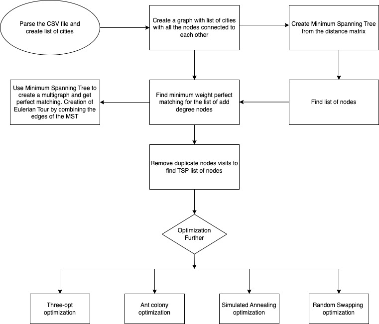

# Optimised Travelling Salesman Problem

This Java class, Driver, is a part of a Travelling Salesman Problem (TSP) solution that aims to optimize the path between crime points read from a CSV file. The class provides various optimization algorithms.

- Three-opt
- Random swapping
- Simulated Annealing
- Ant Colony Optimization

It also visualizes the TSP tour using GraphStream.

### Dependencies

GraphStream: a Java library for handling and visualizing graphs
Java 8 or higher
Usage

1. Compile the Java files:
   `javac Psademo.java`

2. Run the Driver class with the desired optimization algorithm:
   `java Psademo.java`

## Main Functionality

travellingSalesman(String algoType): The main method for solving the TSP problem with the specified algorithm. It reads crime data from a CSV file, computes the tour using the chosen optimization technique, and displays the tour graphically.

solveTsp(List<CrimePoint> crimePoints, String algoType): A helper method that finds the TSP solution by implementing various optimization algorithms.

minimumWeightPerfectMatching(double[][] distanceMatrix, List<Integer> oddVertices): Calculates the minimum weight perfect matching for a given distance matrix and a list of odd vertices.

tourLength(List<Integer> tour, double[][] distanceMatrix): Computes the length of a given TSP tour using a distance matrix.

## Flowchart

### Additional Notes

The input CSV file must be located in the resources folder and named CrimeSampleLarge.csv.

Ensure that you have the GraphStream library installed and the correct JAR file is included in the classpath when compiling and running the Java files.
The visualization of the graph might be slow, especially for large datasets.

The Jars are included in `jars` folder
